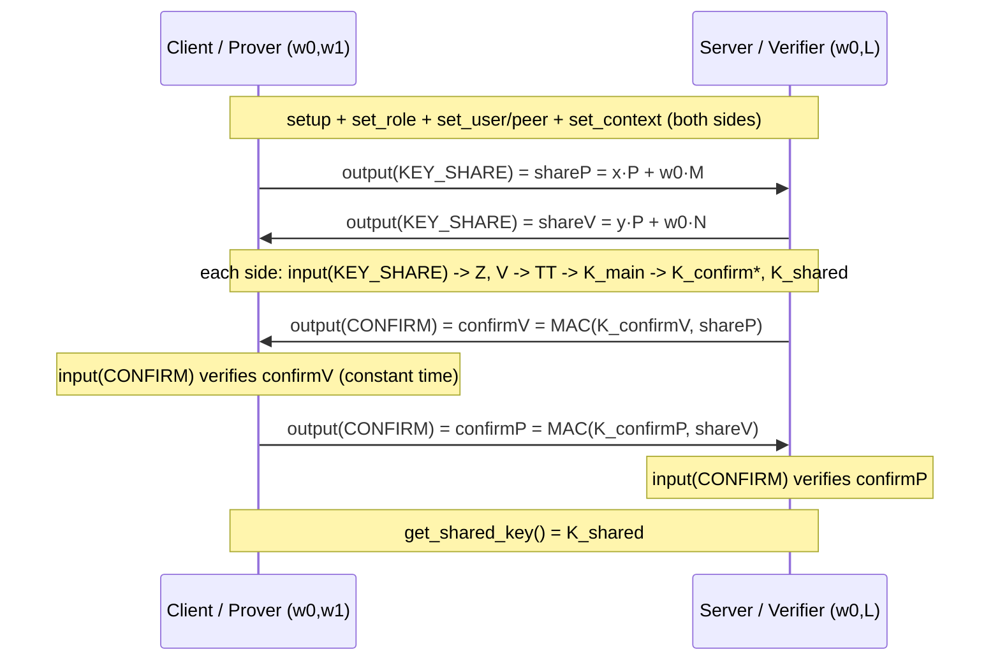

SPAKE2+ implementation architecture
====================================

## Introduction

This document describes the implementation of SPAKE2+
([RFC 9383](https://www.rfc-editor.org/rfc/rfc9383)) in TF-PSA-Crypto: how the
code is layered, which component owns what, the data model, the protocol/state
machine as exposed through the PSA PAKE API, and the security-relevant design
choices.

SPAKE2+ is an *augmented* password-authenticated key exchange (aPAKE): the
Verifier stores only password-derived registration material (`w0` and `L`), not
a value that lets it impersonate the Prover. The companion document
[`docs/spake2p-accelerator-integration.md`](../spake2p-accelerator-integration.md)
covers how to offload SPAKE2+ to a hardware accelerator.

### Scope of this implementation

* Ciphersuites: the `secp_r1` curves **P-256, P-384, P-521**.
* MAC profiles: **HMAC**, **CMAC-AES-128**, and the **Matter** profile
  (HMAC-SHA-256 pinned to P-256).
* Accelerator support: through the spec-defined PSA PAKE driver interface
  (whole-operation transparent / opaque drivers) with the built-in software
  driver as the fallback.
* Out of scope: offline registration (deriving `w0`/`w1`/`L` from a password
  via a PBKDF — RFC 9383 §3.2). That is the application's responsibility; the
  PSA SPAKE2+ key *is* the already-derived material. Twisted-Edwards curves are
  also out of scope.


## Layered organization

SPAKE2+ follows the same "core + PSA drivers" structure as the rest of
TF-PSA-Crypto (see
[`psa-crypto-implementation-structure.md`](psa-crypto-implementation-structure.md)).
Software crypto is itself a PSA driver — the *built-in* driver — reached through
the auto-generated driver-wrapper dispatch layer.

```
   Application
        |  psa_pake_setup / set_role / set_user / set_peer / set_context
        |  psa_pake_output / psa_pake_input / psa_pake_get_shared_key
        v
+-------------------------------------------------------------------+
|  PSA core - PAKE operation state machine          core/psa_crypto.c|
|  - validates stage/step ordering (prologue/epilogue)               |
|  - collects inputs (password key, user, peer, context)             |
|  - drives the SPAKE2+ exchange: KEY_SHARE round, then CONFIRM round |
|  - psa_spake2p_import_key / psa_spake2p_export_public_key          |
+-------------------------------------------------------------------+
        |  psa_driver_wrapper_pake_{setup,output,input,                |
        |                           get_implicit_key,abort}            |
        v
+-------------------------------------------------------------------+
|  Driver dispatch (generated) core/psa_crypto_driver_wrappers.h     |
|  per-operation: transparent driver -> built-in fallback -> opaque  |
+-------------------------------------------------------------------+
        |                                   |
        | (no/!supported accelerator)       | (accelerator present)
        v                                   v
+-----------------------------------+   +---------------------------+
|  Built-in PSA PAKE driver          |   |  Transparent / opaque     |
|  drivers/builtin/psa_crypto_pake.c |   |  PAKE driver (vendor)     |
|  - mbedtls_psa_pake_* entry points |   |  (see accelerator doc)    |
|  - maps PSA steps <-> SPAKE2+ msgs |   +---------------------------+
+-----------------------------------+
        |  mbedtls_spake2p_*  (mbedtls_spake2p_context)
        v
+-------------------------------------------------------------------+
|  Low-level SPAKE2+ protocol module  drivers/builtin/src/spake2p.c  |
|  - per-curve M/N constants, ephemeral, shareP/shareV, Z, V         |
|  - transcript TT, HKDF key schedule, confirmation MAC, CT compare  |
+-------------------------------------------------------------------+
        |  mbedtls_ecp_mul / muladd      mbedtls_md / md_hmac
        |  mbedtls_ecp_point_*           mbedtls_cipher_cmac (CMAC)
        v
+-------------------------------------------------------------------+
|  Built-in primitives: ECP (drivers/builtin/src/ecp.c), MD, CMAC    |
+-------------------------------------------------------------------+
```

### Component responsibilities

| File | Responsibility |
|------|----------------|
| `drivers/builtin/src/spake2p.c` / `…/private/spake2p.h` | Self-contained SPAKE2+ engine on `mbedtls_ecp_*`/`mbedtls_md`/CMAC: M/N tables, ephemeral generation, `shareP`/`shareV`, `Z`/`V`, transcript `TT`, HKDF schedule, MAC + constant-time compare, RFC-vector self-test. Knows nothing about PSA. |
| `drivers/builtin/src/psa_crypto_pake.c` | Built-in PSA PAKE driver. `mbedtls_psa_pake_setup/output/input/get_implicit_key/abort`. Translates `psa_crypto_driver_pake_step_t` ⇄ SPAKE2+ messages, reads collected inputs via `psa_crypto_driver_pake_get_*`, derives the role from the password length. |
| `drivers/builtin/include/mbedtls/private/crypto_builtin_composites.h` | `mbedtls_psa_pake_operation_t` — the built-in driver context union; holds the `mbedtls_spake2p_context` alongside the EC-JPAKE context. |
| `core/psa_crypto.c` | PSA core: the PAKE state machine (`psa_pake_*`), the SPAKE2+ prologue/epilogue, `psa_spake2p_import_key`, `psa_spake2p_export_public_key`, and the `psa_crypto_driver_pake_get_context*` helpers. |
| `include/psa/crypto_extra.h` | Public API surface: key types, algorithm IDs, `psa_spake2p_computation_stage_s`, the driver-inputs `context` field, `PSA_SPAKE2P_STEP_*`, and `PSA_PAKE_{OUTPUT,INPUT}_SIZE`. |
| `include/psa/crypto_sizes.h` | `PSA_EXPORT_KEY_OUTPUT_SIZE` / `PSA_EXPORT_PUBLIC_KEY_OUTPUT_SIZE` for SPAKE2+ keys. |
| `include/psa/crypto_config.h`, `…/crypto_adjust_config_derived.h`, `…/crypto_adjust_config_enable_builtins.h` | Feature selection and built-in enablement (see [Configuration](#configuration)). |


## Roles, keys and algorithms

RFC 9383 has two asymmetric roles. The PSA mapping is:

| PSA role | RFC 9383 role | Password key (`psa_pake_setup`) | Export representation |
|----------|---------------|----------------------------------|-----------------------|
| `PSA_PAKE_ROLE_CLIENT` | Prover | `PSA_KEY_TYPE_SPAKE2P_KEY_PAIR(family)` | `w0 \|\| w1` (two scalars) |
| `PSA_PAKE_ROLE_SERVER` | Verifier | `PSA_KEY_TYPE_SPAKE2P_PUBLIC_KEY(family)` | `w0 \|\| L` (scalar + uncompressed point) |

* **Key size = the curve bit size** (256/384/521), exactly like an ECC key — *not*
  the serialized material length. The serialized lengths follow from it:
  * key pair: `2 · ceil(bits/8)` bytes;
  * public key: `3 · ceil(bits/8) + 1` bytes (a scalar plus an uncompressed point).
* `psa_export_public_key` on a key pair derives the verifier record `w0 || L`
  with `L = w1·P` (`psa_spake2p_export_public_key`).
* A SPAKE2+ key's permitted-algorithm policy must be a SPAKE2+ algorithm or
  `PSA_ALG_NONE`; an explicit incompatible policy is rejected at import.
* `psa_pake_set_role` is validated against the key type
  (CLIENT ⇔ key pair, SERVER ⇔ public key).

Algorithm identifiers (`include/psa/crypto_extra.h`):

| Algorithm | MAC | KDF/Hash | Confirm tag | Notes |
|-----------|-----|----------|-------------|-------|
| `PSA_ALG_SPAKE2P_HMAC(hash)` | HMAC | HKDF/`hash` | `hash` length | Baseline; RFC vectors target this |
| `PSA_ALG_SPAKE2P_CMAC(hash)` | AES-CMAC-128 | HKDF/`hash` | 16 bytes | needs `PSA_WANT_ALG_CMAC` + AES |
| `PSA_ALG_SPAKE2P_MATTER` | HMAC-SHA-256 | HKDF-SHA-256 | 32 bytes | pinned to P-256 |


## Protocol exchange as PSA steps

Only two PSA steps are used: `PSA_PAKE_STEP_KEY_SHARE` and
`PSA_PAKE_STEP_CONFIRM`. The Verifier confirms first (RFC 9383 App. A.5).



### State machine

The computation stage (`struct psa_spake2p_computation_stage_s`) tracks a small
two-round state machine. Each exchange has exactly one input and one output, in
either order; once both are done the round advances.

```
        +-------------------+   one output AND one input
        |   KEY_SHARE round |---------------------------+
        +-------------------+                           |
                                                        v
        +-------------------+   one output AND one input
        |    CONFIRM round  |---------------------------+
        +-------------------+                           |
                                                        v
        +-------------------+   get_shared_key() allowed here
        |     FINISHED      |
        +-------------------+
```

The PSA core enforces this: `psa_spake2p_prologue` checks the requested
`step` matches the current round; `psa_spake2p_epilogue` counts the
input/output and advances the round; `psa_pake_get_shared_key` requires
`round == PSA_SPAKE2P_FINISHED`. The built-in module additionally derives the
key schedule lazily once both key shares are present, so a `CONFIRM` before the
key schedule exists is rejected with `BAD_STATE`.


## Cryptographic core (`spake2p.c`)

For curve point `P` (the generator), per-curve constants `M`, `N` (RFC 9383 §4,
stored compressed and decompressed at setup), and cofactor `h = 1` for `secp_r1`:

```
Prover  (x random):  shareP = x·P + w0·M
Verifier(y random):  shareV = y·P + w0·N
Prover:    Z = x·(shareV − w0·N)      V = w1·(shareV − w0·N)
Verifier:  Z = y·(shareP − w0·M)      V = y·L
```

Transcript and key schedule (`8`-byte little-endian length prefixes; `M`,`N`,
shares, `Z`, `V` uncompressed; `idProver`/`idVerifier` are fixed by RFC role):

```
TT = lt(Context)||Context || lt(idProver)||idProver || lt(idVerifier)||idVerifier
   || lt(M)||M || lt(N)||N || lt(shareP)||shareP || lt(shareV)||shareV
   || lt(Z)||Z || lt(V)||V || lt(w0)||w0

K_main                  = Hash(TT)
K_confirmP || K_confirmV = HKDF(salt=nil, K_main, "ConfirmationKeys")
K_shared                = HKDF(salt=nil, K_main, "SharedKey")
confirmP = MAC(K_confirmP, shareV)     confirmV = MAC(K_confirmV, shareP)
```

HKDF is implemented inline (`spake2p_hkdf`) from `mbedtls_md_hmac` — there is no
standalone `mbedtls_hkdf` in this repository. `K_main = Hash(TT)`; for the HMAC
profiles the confirmation key and tag length equal the hash length, for CMAC
they are 16 bytes; `K_shared` is always the hash length.

### Security-relevant design choices

* **Constant-time secret handling.** `mbedtls_ecp_muladd` is *not* constant-time,
  so the secret scalars (`w0`, `w1`, and the ephemeral) are never passed to it.
  Each secret scalar multiplication uses the constant-time `mbedtls_ecp_mul`
  (which applies coordinate randomization and a fixed-window ladder when given an
  RNG); the two results are then combined with a public-scalar
  `mbedtls_ecp_muladd(1, A, 1, B)`. This is why `psa_pake_input(KEY_SHARE)` takes
  an RNG even though it produces no new secret. `w0`/`w1` are reduced mod the
  group order at setup so the constant-time multiply is well-defined.
* **Group-membership checks.** Received key shares are validated with
  `mbedtls_ecp_check_pubkey` (on-curve, in-range, not the identity), which is
  exactly subgroup membership for cofactor-1 curves (RFC 9383 §6). As defence in
  depth, a computed `Z` or `V` equal to the identity aborts the exchange.
* **Confirmation compare** uses `mbedtls_ct_memcmp`; a mismatch yields
  `MBEDTLS_ERR_ECP_VERIFY_FAILED` → `PSA_ERROR_INVALID_SIGNATURE`.
* **Zeroization.** The transcript, `K_main`, the HKDF working buffers and the MAC
  scratch are zeroized; `mbedtls_spake2p_free` zeroizes the derived keys and
  frees the identity/context copies; scalars are `mbedtls_mpi_free`'d.


## Built-in PSA driver layer (`psa_crypto_pake.c`)

The built-in driver bridges the per-step PSA PAKE interface to the
message-oriented `mbedtls_spake2p_*` API:

* `mbedtls_psa_pake_setup` reads `cipher_suite`, password material, `user`,
  `peer` and `context` via the `psa_crypto_driver_pake_get_*` accessors; maps the
  PSA algorithm to `{HMAC,CMAC}` + hash and the family/bits to an
  `mbedtls_ecp_group_id`; **derives the role from the password length**
  (`2·plen` ⇒ Prover/client, `3·plen+1` ⇒ Verifier/server); then calls
  `mbedtls_spake2p_setup` + `set_user`/`set_peer`/`set_context`.
* `output`/`input` switch on the driver step (`PSA_SPAKE2P_STEP_KEY_SHARE` /
  `PSA_SPAKE2P_STEP_CONFIRM`) to the corresponding `write_*`/`read_*` call.
* `get_implicit_key` → `mbedtls_spake2p_get_shared_key`; `abort` →
  `mbedtls_spake2p_free`.

The built-in operation context (`mbedtls_psa_pake_operation_t`) carries the
`mbedtls_spake2p_context` in its `ctx` union, gated by
`MBEDTLS_PSA_BUILTIN_SPAKE2P`.


## Configuration

```
PSA_WANT_ALG_SPAKE2P_HMAC / _CMAC / _MATTER        (include/psa/crypto_config.h)
        |
        |  crypto_adjust_config_derived.h
        v
PSA_WANT_ALG_SOME_SPAKE2P  -->  PSA_WANT_ALG_SOME_PAKE
        |
        |  drivers/builtin/.../crypto_adjust_config_enable_builtins.h
        v   (when not accelerated)
MBEDTLS_PSA_BUILTIN_PAKE, MBEDTLS_PSA_BUILTIN_ALG_SPAKE2P_{HMAC,CMAC,MATTER},
MBEDTLS_SPAKE2P_C, MBEDTLS_ECP_C, MBEDTLS_BIGNUM_C, secp_r1 curves
(+ MBEDTLS_CMAC_C, MBEDTLS_AES_C, MBEDTLS_CIPHER_C for the CMAC profile)
```

* `MBEDTLS_SPAKE2P_C` gates the low-level module; `MBEDTLS_PSA_BUILTIN_SPAKE2P`
  (set in `crypto_builtin_composites.h` from the `BUILTIN_ALG_SPAKE2P_*` macros)
  gates the built-in driver branches.
* Key generation is **not** supported (`PSA_WANT_KEY_TYPE_SPAKE2P_KEY_PAIR_GENERATE`
  is off): SPAKE2+ keys are password-derived registration material, not random.


## Test architecture

| Layer | Test |
|-------|------|
| Protocol module (RFC vectors) | `mbedtls_spake2p_self_test` — exact RFC 9383 P-256 HMAC & CMAC vectors, a random round-trip and a tampered-confirm rejection; registered via `tests/suites/test_suite_spake2p.{data,function}`. |
| PSA operation | `spake2p_rounds` (HMAC/CMAC/Matter × P-256/384/521) and negatives — `spake2p_bad_confirm`, `spake2p_confirm_bad_length`, `spake2p_bad_key_share`, `spake2p_role_mismatch`, `spake2p_password_mismatch` — plus `spake2p_import_export` and `spake2p_size_macros`, in `test_suite_psa_crypto_pake`. |
| Metadata | SPAKE2+ algorithm classification in `test_suite_psa_crypto_metadata`. |
| Systematic generation | `not_supported`, `op_fail` and `storage_format` generated suites cover the SPAKE2+ key types. |
| Driver dispatch | `spake2p_driver_hits` / `spake2p_driver_forced_status` in `test_suite_psa_crypto_driver_wrappers` (test-driver build) confirm dispatch through the transparent driver. |
| Import negatives | `test_suite_psa_crypto.data` SPAKE2+ public-key rejection cases. |

See `docs/spake2p-accelerator-integration.md` for how the dispatch layer lets an
accelerator replace the built-in driver.
