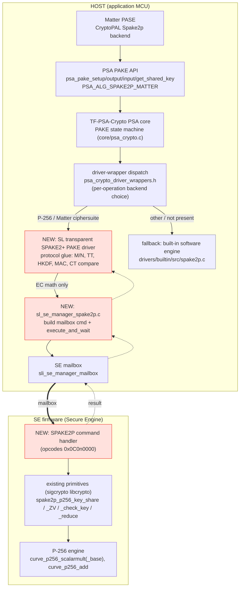
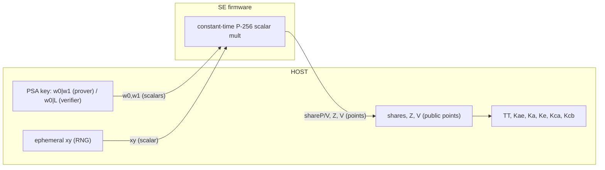
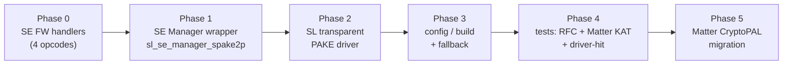
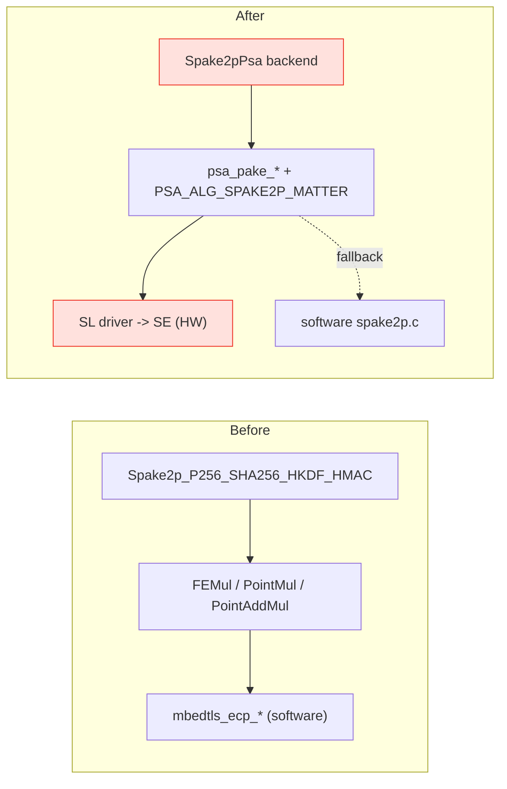
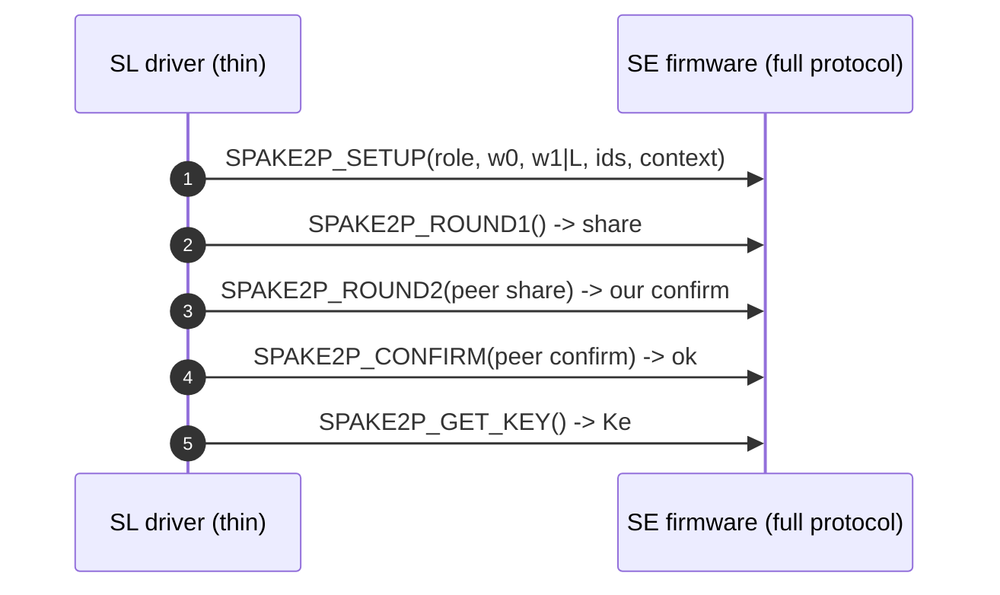

# Hardware-accelerated SPAKE2+ in SiSDK

Wiring SPAKE2+ to the Silicon Labs Secure Engine (SE) through SE Manager, on both
the **HOST** and **SE firmware** sides, so Matter PASE runs on accelerated,
constant-time P-256 hardware.

This document is the integration design. It complements the software/driver guides
[`spake2p-accelerator-integration.md`](spake2p-accelerator-integration.md),
[`architecture/spake2p-implementation.md`](architecture/spake2p-implementation.md)
and [`architecture/spake2p-matter-rfc9383.md`](architecture/spake2p-matter-rfc9383.md).

---

## 1. Where we are today

| Layer | State |
|-------|-------|
| PSA SPAKE2+ API (`psa_pake_*`, `PSA_ALG_SPAKE2P_MATTER`) | Present (TF-PSA-Crypto and mbedtls 3.6.4) |
| Built-in SPAKE2+ engine (`drivers/builtin/src/spake2p.c`) | Software only: `mbedtls_ecp_*` + `mbedtls_md` |
| `platform/sl_psa_driver` PAKE acceleration | **None** - no PAKE driver exists |
| SE firmware P-256 SPAKE2+ primitives (`sigcrypto` `spake2p_p256_*`) | **Present but dormant** - no HOST mailbox command exposes them |
| EC-JPAKE acceleration (`se_jpake.c` + `SLI_SE_COMMAND_JPAKE_*`) | Shipping - the pattern we mirror |

So SPAKE2+ is **not** hardware accelerated today. The SE already has the hard EC
math; what is missing is (a) a HOST mailbox command to reach it and (b) a PSA PAKE
driver that routes the exchange to the SE.

---

## 2. Two architectures

The split is *how much of the protocol runs in the SE*.

| | **Option A - EC-primitive offload** (recommended) | **Option B - full SPAKE2+ in SE** |
|--|--------------------------------------------------|-----------------------------------|
| SE FW does | the secret-scalar EC math only (`key_share`, `Z`/`V`, `check_key`, `reduce`) | the whole protocol: shares, `Z`/`V`, transcript `TT`, HKDF, confirm MAC, state |
| HOST driver does | M/N, ephemeral RNG, `TT`, HKDF, confirm MAC, CT compare | a thin shim that marshals steps (like `se_jpake.c`) |
| New SE FW code | 4 thin mailbox handlers over **existing** `spake2p_p256_*` | substantial: transcript/KDF/MAC + state machine in SE FW |
| Secrets on the mailbox | `w0`,`w1`,ephemeral cross HOST -> SE per call | stay inside the SE |
| Round-trips per handshake | ~4 mailbox calls | ~3 mailbox calls |
| Effort | low (reuses sigcrypto primitives + the software protocol glue) | high |

**Recommendation: Option A.** It matches exactly what the SE firmware already
exposes, reuses the audited software protocol glue from `spake2p.c`, and is the
smallest change that delivers HW-accelerated, constant-time scalar multiplication.
Option B is documented as a future step when full secret isolation in the SE is
required.

The rest of this document details **Option A**; Section 7 sketches Option B.

---

## 3. Component wiring (Option A)



Red = new components. The HOST driver keeps all protocol/transcript/KDF/MAC logic;
only the four EC primitives cross into the SE.

---

## 4. The SE firmware mailbox contract

Mirror the EC-JPAKE command block in
`platform/.../se_manager/inc/sli_se_manager_mailbox.h`
(`SLI_SE_COMMAND_JPAKE_R1_GENERATE` = `0x0B000000` ...). Add a SPAKE2+ block:

| Command (illustrative opcode) | Inputs | Outputs | Wraps (`sigcrypto`) |
|-------------------------------|--------|---------|---------------------|
| `SLI_SE_COMMAND_SPAKE2P_REDUCE` (`0x0C000000`) | `xs[]` | `x[32]` | `spake2p_p256_reduce` |
| `SLI_SE_COMMAND_SPAKE2P_CHECK_KEY` (`0x0C010000`) | `K[65]` | status | `spake2p_p256_check_key` |
| `SLI_SE_COMMAND_SPAKE2P_KEY_SHARE` (`0x0C020000`) | `w0[32]`, `xy[32]`, `MN[65]` | `XY[65]` | `spake2p_p256_get_key_share` |
| `SLI_SE_COMMAND_SPAKE2P_ZV` (`0x0C030000`) | `w0[32]`, `w1[32]`/nil, `xy[32]`, `YX[65]`, `NM[65]`, `L[65]`/nil | `Z[65]`, `V[65]` | `spake2p_p256_get_ZV` |

These four cover **all** secret-scalar EC math on P-256. `w1`/`L` are nil on the
opposite role (a one-bit parameter selects prover vs verifier in `ZV`). The handler
is a thin unpack-and-call over functions that already exist in the SE `libcrypto`
(see `sigcrypto/reference/include/spake2p_p256.h`).

The HOST issues these via a new SE Manager module that mirrors `se_jpake.c`:

```c
/* platform/.../se_manager/inc/sl_se_manager_spake2p.h (new) */
sl_status_t sl_se_spake2p_reduce(sl_se_command_context_t *ctx,
                                 const uint8_t *xs, size_t xs_len,
                                 uint8_t x[32]);
sl_status_t sl_se_spake2p_check_key(sl_se_command_context_t *ctx,
                                    const uint8_t K[65]);
sl_status_t sl_se_spake2p_key_share(sl_se_command_context_t *ctx,
                                    const uint8_t w0[32], const uint8_t xy[32],
                                    const uint8_t MN[65], uint8_t XY[65]);
sl_status_t sl_se_spake2p_zv(sl_se_command_context_t *ctx,
                             const uint8_t w0[32], const uint8_t *w1 /*or NULL*/,
                             const uint8_t xy[32], const uint8_t YX[65],
                             const uint8_t NM[65], const uint8_t *L /*or NULL*/,
                             uint8_t Z[65], uint8_t V[65]);
```

Each function builds a `sli_se_mailbox_command_t`, adds the inputs/outputs with
`sli_se_mailbox_command_add_input/output`, sets the role parameter, and calls
`sli_se_execute_and_wait` - exactly the shape of
`mbedtls_ecjpake_write_round_one/two` in `se_jpake.c`.

---

## 5. The handshake, step by step (Option A)

```mermaid
sequenceDiagram
    autonumber
    participant App as Matter / App
    participant Core as PSA core FSM
    participant Drv as SL SPAKE2+ driver (HOST)
    participant SE as SE firmware

    App->>Core: psa_pake_setup(SPAKE2P_MATTER, key=w0|w1 or w0|L)
    Core->>Drv: pake_setup(inputs)
    Note over Drv: role from password length; load M,N (P-256)

    App->>Core: psa_pake_output(KEY_SHARE)
    Core->>Drv: pake_output(KEY_SHARE)
    Drv->>Drv: ephemeral xy <- RNG
    Drv->>SE: SPAKE2P_KEY_SHARE(w0, xy, M or N)
    SE-->>Drv: shareP / shareV  (= xy*P + w0*MN)
    Drv-->>Core: share

    App->>Core: psa_pake_input(KEY_SHARE, peer share)
    Core->>Drv: pake_input(KEY_SHARE, YX)
    Drv->>SE: SPAKE2P_CHECK_KEY(YX)
    SE-->>Drv: ok
    Drv->>SE: SPAKE2P_ZV(w0, w1|nil, xy, YX, NM, L|nil)
    SE-->>Drv: Z, V
    Drv->>Drv: TT = transcript;  Kae=SHA256(TT);  Ka||Ke;  Kca||Kcb=HKDF(Ka)

    App->>Core: psa_pake_output(CONFIRM)
    Core->>Drv: pake_output(CONFIRM)
    Drv-->>Core: confirm = HMAC(Kc, peer share)

    App->>Core: psa_pake_input(CONFIRM, peer confirm)
    Core->>Drv: pake_input(CONFIRM)
    Drv->>Drv: ct_memcmp(expected, received)  -> set confirmed

    App->>Core: psa_pake_get_shared_key()
    Core->>Drv: pake_get_implicit_key()
    Drv-->>Core: Ke  (gated on confirmed)
```

Mailbox traffic per handshake: one `KEY_SHARE`, one `CHECK_KEY`, one `ZV`
(plus `REDUCE` only during registration). Transcript, HKDF and the confirmation
MAC run on the HOST and may themselves use SE-accelerated SHA-256/HMAC through the
existing PSA hash/MAC drivers.

---

## 6. Dispatch and key location

```mermaid
flowchart TD
    A["psa_pake_output/input (first call)"] --> B{password key location}
    B -- "local storage" --> C{SL transparent PAKE driver<br/>supports this ciphersuite?<br/>(P-256 + SPAKE2P_MATTER/HMAC)}
    C -- yes --> D["SL driver runs the exchange<br/>operation->id = SL"]
    C -- "NOT_SUPPORTED" --> E{MBEDTLS_PSA_BUILTIN_PAKE?}
    E -- yes --> F["software spake2p.c<br/>operation->id = builtin"]
    E -- no --> G["PSA_ERROR_NOT_SUPPORTED"]
    B -- "secure element (wrapped w0|L)" --> H["SL opaque PAKE driver<br/>operation->id = opaque"]

    style D fill:#ffe1dd,stroke:#EE3124
    style H fill:#ffe1dd,stroke:#EE3124
```

Dispatch is **per operation** (the backend is fixed at the first output/input). The
SL driver returns `PSA_ERROR_NOT_SUPPORTED` from `pake_setup` for anything it does
not accelerate (non-P-256, non-Matter/HMAC) so the software engine transparently
handles those. The dispatch edit lives in the hand-written PAKE section of
`scripts/data_files/driver_templates/psa_crypto_driver_wrappers.h.jinja`
(see `spake2p-accelerator-integration.md` Step 3).

---

## 7. Key and data model (and threat model)



- **Option A** passes the secret scalars `w0`, `w1`, `xy` HOST -> SE for each EC
  call. HOST and SE are on the same die and the mailbox is not externally
  observable, so this is acceptable for the Matter PASE threat model, but it does
  mean the password-derived scalars are briefly in HOST RAM. **Option B** keeps
  them inside the SE.
- The SE scalar multiply is constant-time, satisfying the SPAKE2+ obligation for
  `w0`, `w1` and the ephemeral. The HOST never calls a variable-time `muladd` on a
  secret.
- `Z`, `V`, the shares and the confirmation MACs are public; `Ke` (the session
  secret) is released only after the confirmation MAC verifies (the `confirmed`
  gate, RFC 9383 / Matter).

---

## 8. Implementation plan (Option A)

Phased so each phase is testable on its own. Phases 1-2 can be developed against a
software stub of `sl_se_spake2p_*` before the SE firmware lands (de-risks the
closed-firmware dependency).



- **Phase 0 - SE FW handlers.** Add the 4 opcodes + handlers calling
  `spake2p_p256_*`. Buffer layout modelled on `se_jpake.c` R1/R2. *SE firmware
  build (closed) - see risks.* Verify against `sigcrypto/tests/spake2_srp_check.py`
  and RFC 9383 P-256 vectors.
- **Phase 1 - SE Manager wrapper.** New `sl_se_manager_spake2p.{c,h}` + opcode block
  in `sli_se_manager_mailbox.h` + se_manager `.slcc` entry. Unit-test each call
  against known vectors.
- **Phase 2 - SL transparent PAKE driver.** Implement the 5 entry points; lift the
  protocol glue (M/N, TT, HKDF, MAC, CT compare) from `spake2p.c`, swapping
  `mbedtls_ecp_*` for `sl_se_spake2p_*`. Register driver JSON + add the dispatch
  branch (try SL, fall back to builtin).
- **Phase 3 - config/build.** `PSA_CRYPTO_ACCELERATOR_DRIVER_PRESENT`, a feature
  gate (`SL_SE_SUPPORTS_SPAKE2P`), keep `MBEDTLS_PSA_BUILTIN_PAKE` for fallback.
- **Phase 4 - tests.** RFC 9383 vectors + Matter interop KAT
  (`tests/data_files/spake2p_matter_p256_interop.txt`); `spake2p_driver_hits`
  (`test_suite_psa_crypto_driver_wrappers`) proves the SL driver ran; negatives
  (bad confirm/share/role); software fallback still green.
- **Phase 5 - Matter.** Section 9.
- **Opaque variant (optional).** If `w0|L` is SE-wrapped, add the `_opaque_` entry
  points; dispatch selects by key location.

---

## 9. Matter migration plan (full CryptoPAL)

connectedhomeip's `Spake2p_P256_SHA256_HKDF_HMAC`
(`src/crypto/CHIPCryptoPALmbedTLS.cpp`, or the PSA variant `CHIPCryptoPALPSA.cpp`)
today drives the math itself over mbedtls EC primitives (`FELoad/FEMul/FEWrite`,
`PointMul/PointAddMul/PointCofactorMul`, `PointIsValid`). The migration replaces
that backend with one that calls the PSA PAKE API, so it automatically benefits
from the SL driver and the SE.



Method mapping:

| Matter `Spake2p` method | PSA PAKE |
|-------------------------|----------|
| `Init` / `BeginProver` / `BeginVerifier` | import `w0\|w1` (prover) or `w0\|L` (verifier) as `PSA_KEY_TYPE_SPAKE2P_{KEY_PAIR,PUBLIC_KEY}(SECP_R1)`; `psa_pake_setup(PSA_ALG_SPAKE2P_MATTER)` + `psa_pake_set_role` + `set_user`/`set_peer` + `set_context` |
| `ComputeRoundOne` | `psa_pake_output(KEY_SHARE)`; `psa_pake_input(KEY_SHARE)` of the peer share |
| `ComputeRoundTwo` | `psa_pake_output(CONFIRM)` |
| `KeyConfirm` | `psa_pake_input(CONFIRM)` (constant-time verify) |
| `GetKeys` | `psa_pake_get_shared_key` -> `Ke` |

- **Registration.** Matter's `w0/w1/L` come from PBKDF2 over the passcode: the
  commissioner derives `(w0,w1)`, the commissionee stores `(w0,L)`. Feed these into
  PSA as an imported SPAKE2P key, or derive in-place with
  `psa_key_derivation_output_key` (registration, issue #9381). Reconcile Matter's
  PBKDF2 salt/iterations with the TF-PSA-Crypto Matter profile.
- **Files (in the Matter repo / SL extension, outside this checkout):** the SL
  CryptoPAL Spake2p backend (`CHIPCryptoPALPSA.cpp` or a new `Spake2pPsa`), the
  platform crypto config that selects it, and the build flag enabling
  `PSA_ALG_SPAKE2P_MATTER`.
- **Verification.** `chip-tool` PASE commissioning against the device, plus the
  Matter interop KAT for the math.

---

## 10. Option B (full SPAKE2+ in the SE), for reference



Here the SE owns the transcript, HKDF, MAC and state (like EC-JPAKE's
R1/R2/session-key). Secrets never leave the SE; the HOST driver is a marshaller.
Cost: substantial new SE firmware (transcript/KDF/MAC + state) that does not exist
today. Pursue when full in-SE secret isolation is required.

---

## 11. Risks and dependencies

- **SE firmware is closed/signed.** The `spake2p_p256_*` primitives exist in
  `libcrypto`, but exposing them via a mailbox command is an SE firmware release
  owned by the SE team. Develop Phases 1-2 against a software stub of
  `sl_se_spake2p_*` until the SE build is available.
- **No SL SE driver layer for TF-PSA-Crypto yet.** `platform/sl_psa_driver` targets
  mbedtls 3.6.4; a TF-PSA-Crypto SL PAKE driver is greenfield and implies a wider
  "bring SL SE acceleration to TF-PSA-Crypto" effort. If a nearer-term product path
  is needed, the same driver can be built against the 3.6.4 PSA PAKE dispatch first.
- **Secrets on the mailbox (Option A).** `w0/w1/xy` cross HOST -> SE per call; note
  in the threat model. Option B removes this.
- **PAKE driver-wrapper codegen is still hand-written**, so the dispatch edit is
  manual until PAKE codegen lands upstream. See
  [`pake-driver-codegen.md`](pake-driver-codegen.md) for the analysis and a targeted
  design that would let the SL driver be added by JSON alone (no template edit).

## 12. Summary

| Piece | New? | Where |
|-------|------|-------|
| 4 SE FW mailbox handlers over `spake2p_p256_*` | new | SE firmware |
| `sl_se_manager_spake2p.{c,h}` + opcodes | new | `platform/.../se_manager` |
| SL transparent (and opaque) PAKE driver | new | TF-PSA-Crypto driver + JSON + wrapper edit |
| Protocol glue (TT/HKDF/MAC) | reuse | lifted from `drivers/builtin/src/spake2p.c` |
| Software fallback | reuse | built-in `spake2p.c` |
| Matter PSA-PAKE backend | new | connectedhomeip / SL Matter extension |
