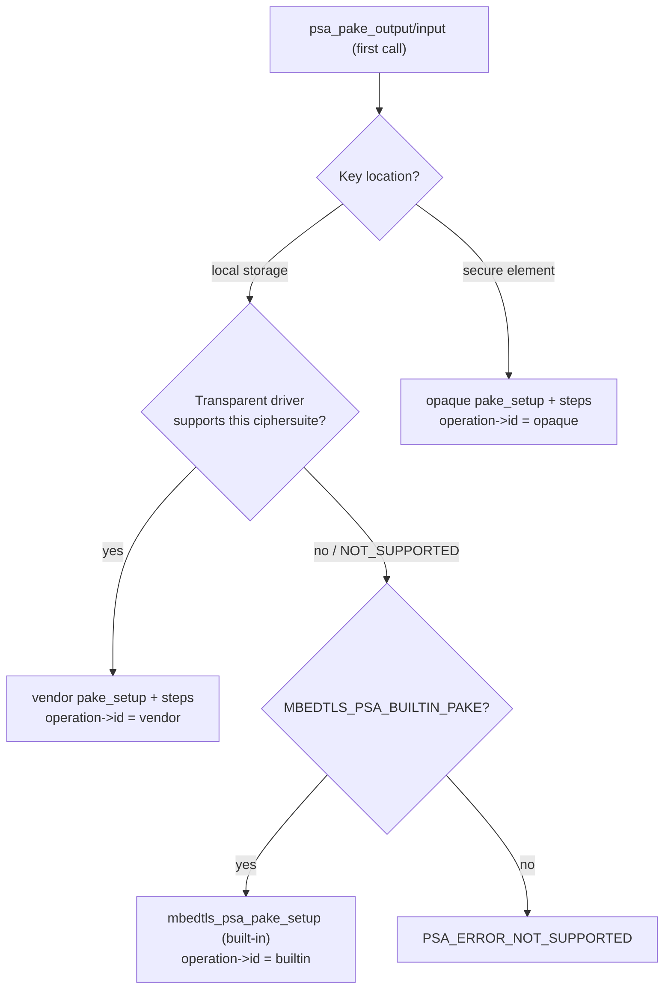

Wiring accelerators for SPAKE2+ (and PAKE in general)
=====================================================

## Purpose

This guide explains *where* and *how* a hardware accelerator can be plugged in
for SPAKE2+, what the PSA driver dispatch does, and the practical wiring steps.
It complements the implementation overview in
[`architecture/spake2p-implementation.md`](architecture/spake2p-implementation.md)
and the general driver guides
[`psa-driver-example-and-guide.md`](psa-driver-example-and-guide.md) /
[`proposed/psa-driver-interface.md`](proposed/psa-driver-interface.md).

The design goal is that crypto acceleration is pluggable *where it makes sense*:
you can either (A) plug in a **complete SPAKE2+ driver** that an accelerator
backs, or (B) accelerate the **EC primitives** the software path uses, and this
document is explicit about which of those the current architecture supports.

## TL;DR

* **Supported today:** a whole-operation **transparent** (or **opaque**) PSA
  **PAKE driver** for SPAKE2+. The dispatch already routes SPAKE2+ through it,
  with the built-in software driver as fallback. The driver implements the whole
  exchange and calls the accelerator's primitives internally.
* **Not available today:** transparently offloading the *built-in* module's
  `mbedtls_ecp_mul`/`muladd` to an accelerator. There are no `MBEDTLS_ECP_ALT`
  hooks, and `p256-m`/PSA transparent **ECC** drivers operate at the
  PSA-operation level; they do not intercept the built-in PAKE's EC math.
* **One-time plumbing caveat:** the PAKE section of the driver-wrapper template
  is currently hand-written, so adding a *real* vendor PAKE driver also means
  editing that template (see [Step 3](#step-3-wire-the-dispatch)).


## How PSA dispatches a PAKE operation

Dispatch is **per operation, not per step**: when inputs are complete and the
first `psa_pake_output`/`psa_pake_input` is called, the core picks exactly one
backend for the entire exchange and records it in `operation->id`. All later
steps go to the same backend. A driver cannot accelerate just one step.



This is `psa_driver_wrapper_pake_setup` in the generated
`core/psa_crypto_driver_wrappers.h`; the subsequent
`pake_output`/`pake_input`/`pake_get_implicit_key`/`pake_abort` wrappers switch
on `operation->id`. The dispatch is **algorithm-agnostic**: SPAKE2+ already
flows through it unchanged (the in-tree test driver proves this in
`test_suite_psa_crypto_driver_wrappers`: `spake2p_driver_hits`).


## Option A: a whole-operation transparent SPAKE2+ driver (recommended)

This is the spec-defined, supported path. The driver implements the five PAKE
entry points; the accelerator is invoked *inside* them.

```
   PSA core (state machine, input collection)
        |  psa_driver_wrapper_pake_*  (per-operation dispatch)
        v
+-------------------------------------------------------------+
|  Vendor transparent SPAKE2+ driver                          |
|  <prefix>_transparent_pake_setup / _output / _input /       |
|  _get_implicit_key / _abort                                 |
|                                                             |
|  reads inputs via:  psa_crypto_driver_pake_get_password()   |
|                     psa_crypto_driver_pake_get_cipher_suite()|
|                     psa_crypto_driver_pake_get_user/peer()   |
|                     psa_crypto_driver_pake_get_context*()    |  <- SPAKE2+
|                                                             |
|  implements the SPAKE2+ protocol glue:                      |
|     M/N constants, transcript TT, HKDF schedule, MAC        |
|        |  EC scalar mult / point add / mod arith            |
|        v                                                    |
|     +-------------------------------------------+           |
|     |  Accelerator (e.g. EC/PK engine) primitives|          |
|     +-------------------------------------------+           |
+-------------------------------------------------------------+
```

### Entry points

A transparent driver with JSON `"prefix": "acme"` provides:

```
psa_status_t acme_transparent_pake_setup(
        acme_transparent_pake_operation_t *operation,
        const psa_crypto_driver_pake_inputs_t *inputs);
psa_status_t acme_transparent_pake_output(
        acme_transparent_pake_operation_t *operation,
        psa_crypto_driver_pake_step_t step,
        uint8_t *output, size_t output_size, size_t *output_length);
psa_status_t acme_transparent_pake_input(
        acme_transparent_pake_operation_t *operation,
        psa_crypto_driver_pake_step_t step,
        const uint8_t *input, size_t input_length);
psa_status_t acme_transparent_pake_get_implicit_key(
        acme_transparent_pake_operation_t *operation,
        uint8_t *output, size_t output_size, size_t *output_length);
psa_status_t acme_transparent_pake_abort(
        acme_transparent_pake_operation_t *operation);
```

The opaque (secure-element) variant is identical with `_opaque_` in the name and
is selected when the password key lives in the driver's key location.

### Reading the collected inputs

`pake_setup` receives an opaque `psa_crypto_driver_pake_inputs_t`. Use the
accessors (do **not** poke the struct):

| Accessor | Returns |
|----------|---------|
| `psa_crypto_driver_pake_get_cipher_suite` | algorithm (e.g. `PSA_ALG_SPAKE2P_HMAC(...)`), primitive type, family, bits |
| `psa_crypto_driver_pake_get_password_len` / `_get_password` | the SPAKE2+ registration material: `w0\|\|w1` (Prover) or `w0\|\|L` (Verifier) |
| `psa_crypto_driver_pake_get_user(_len)` / `_get_peer(_len)` | identities for the transcript |
| `psa_crypto_driver_pake_get_context_len` / `_get_context` | the optional SPAKE2+ `Context` (length 0 is valid), **SPAKE2+-specific** |

Derive the role the same way the built-in driver does: the password length is
`2·ceil(bits/8)` for the Prover (`w0\|\|w1`) and `3·ceil(bits/8)+1` for the
Verifier (`w0\|\|L`).

### What the driver must implement

Because dispatch is whole-operation, the driver owns the **entire** protocol:
the per-curve `M`/`N` constants, ephemeral generation, `shareP`/`shareV`,
`Z`/`V`, the transcript `TT`, the HKDF schedule and the confirmation MAC (see
[`architecture/spake2p-implementation.md`](architecture/spake2p-implementation.md)
for the exact formulas). The accelerator is called only for the heavy/sensitive
math (scalar multiplication, point addition, modular arithmetic). The protocol
logic does **not** come for free from the built-in module; that is the cost of
this approach.

```mermaid
sequenceDiagram
    participant Core as PSA core
    participant Drv as Vendor SPAKE2+ driver
    participant HW as Accelerator
    Core->>Drv: pake_setup(inputs)
    Drv->>Drv: get_cipher_suite / get_password / get_user/peer / get_context
    Note over Drv: derive role from password length; load M,N
    Core->>Drv: pake_output(KEY_SHARE)
    Drv->>HW: x·P , w0·M  (constant-time scalar mults)
    HW-->>Drv: points
    Drv-->>Core: shareP
    Core->>Drv: pake_input(KEY_SHARE, shareV)
    Drv->>HW: subgroup check; Z,V scalar mults
    Drv->>Drv: TT, HKDF -> K_confirm*, K_shared
    Core->>Drv: pake_output(CONFIRM) / pake_input(CONFIRM)
    Drv-->>Core: confirmP / verify confirmV (constant-time)
    Core->>Drv: pake_get_implicit_key()
    Drv-->>Core: K_shared
```

### Constant-time obligation

The driver must keep the password material (`w0`, `w1`) and the ephemeral on a
constant-time path. The built-in module's pattern is the reference: do each
secret scalar multiplication with a constant-time routine, and only combine
points with a public-scalar add. If the accelerator's scalar-mult is
constant-time, route the secret mults through it.


## Option B: accelerate the EC primitives under the built-in (NOT available)

It is tempting to keep the built-in SPAKE2+ protocol and only offload its
`mbedtls_ecp_mul`/`mbedtls_ecp_muladd` calls. **This is not possible in
TF-PSA-Crypto today:**

```
   spake2p.c  --calls-->  mbedtls_ecp_mul / mbedtls_ecp_muladd
                                  |
                                  v
                        built-in software ECP only
                                  X
        no MBEDTLS_ECP_ALT / MBEDTLS_ECP_INTERNAL_ALT hooks
        p256-m / PSA transparent ECC drivers hook PSA *operations*
            (ECDH/ECDSA/keygen), not mbedtls_ecp_mul
        PSA raw key agreement (ECDH) returns only the X-coordinate,
            so it cannot build x·G + w0·M or a muladd
```

Consequences:

* A vendor PSA **ECC** driver (ECDH/ECDSA) accelerates those operations but does
  **nothing** for the built-in PAKE math.
* `p256-m` likewise does not change the built-in PAKE path.

Enabling Option B would require **new** infrastructure: either an
`MBEDTLS_ECP_ALT`-style replacement of `mbedtls_ecp_mul`/`muladd`, or a PSA-level
"EC primitive" driver interface that `spake2p.c` (and `ecjpake.c`) route
through. That is a general TF-PSA-Crypto enhancement, independent of SPAKE2+, and
is out of scope here. Until it exists, **Option A is the way to use an
accelerator for SPAKE2+.**


## Step-by-step: adding a transparent SPAKE2+ driver

### Step 1: describe the driver

Add a transparent driver JSON under `scripts/data_files/driver_jsons/` (schema:
`driver_transparent_schema.json`), with a unique `"prefix"` and a PAKE capability
naming the SPAKE2+ algorithms/curves you accelerate, and register it in
`driverlist.json`. See `mbedtls_test_transparent_driver.json` and
`p256_transparent_driver.json` for the format.

### Step 2: implement the entry points

Provide `<prefix>_transparent_pake_{setup,output,input,get_implicit_key,abort}`
and your `<prefix>_transparent_pake_operation_t` context type, per
[Option A](#option-a-a-whole-operation-transparent-spake2-driver-recommended).
Return `PSA_ERROR_NOT_SUPPORTED` from `pake_setup` for ciphersuites you do not
handle so the core falls back to the built-in driver.

### Step 3: wire the dispatch

> **Caveat:** unlike most operations, the PAKE section of
> `scripts/data_files/driver_templates/psa_crypto_driver_wrappers.h.jinja` is
> **hand-written** and is not yet generated from the JSON capabilities (PAKE
> codegen migration is pending). So you must add your driver's calls to the PAKE
> wrappers there, mirroring the existing `mbedtls_test_transparent_pake_*` /
> `PSA_CRYPTO_DRIVER_TEST` blocks (try the transparent driver before the
> `MBEDTLS_PSA_BUILTIN_PAKE` fallback). Once PAKE codegen lands this step becomes
> automatic.

### Step 4: build and test

* Configure with your driver present (`PSA_CRYPTO_ACCELERATOR_DRIVER_PRESENT`)
  and, if you keep the built-in for unsupported ciphersuites, leave
  `MBEDTLS_PSA_BUILTIN_PAKE` enabled for fallback.
* Validate against the RFC 9383 vectors and the round-trip / negative tests
  (`test_suite_psa_crypto_pake`, `test_suite_spake2p`), and the dispatch
  hit-count tests in `test_suite_psa_crypto_driver_wrappers`
  (`spake2p_driver_hits`). These confirm your driver, not the built-in, runs the
  exchange.

### Step 5: opaque keys (optional)

If the password key lives in a secure element, provide the `_opaque_` PAKE entry
points instead; dispatch selects them by the key's lifetime/location.


## Summary

| You have… | Use… | Status |
|-----------|------|--------|
| A full SPAKE2+ engine, or an EC/PK engine you drive from your own SPAKE2+ code | Transparent (or opaque) PAKE driver (Option A) | Supported; dispatch wired (template edit needed) |
| Only an EC primitive engine, want to keep the built-in protocol | EC-primitive offload (Option B) | Not available; needs new pluggability layer |
| A PSA ECC (ECDH/ECDSA) driver | N/A | Does not affect the built-in PAKE path |
